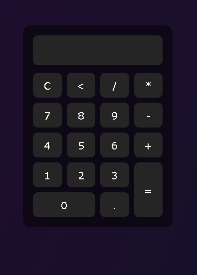

# Calculator

A simple and responsive calculator built with HTML, CSS, and JavaScript.

## Preview

## Features

- Basic arithmetic operations
- Clear button
- Delete button
- Responsive button layout
- Interactive user interface

## Technologies Used

- HTML
- CSS
- JavaScript
- Flexbox
- CSS Grid